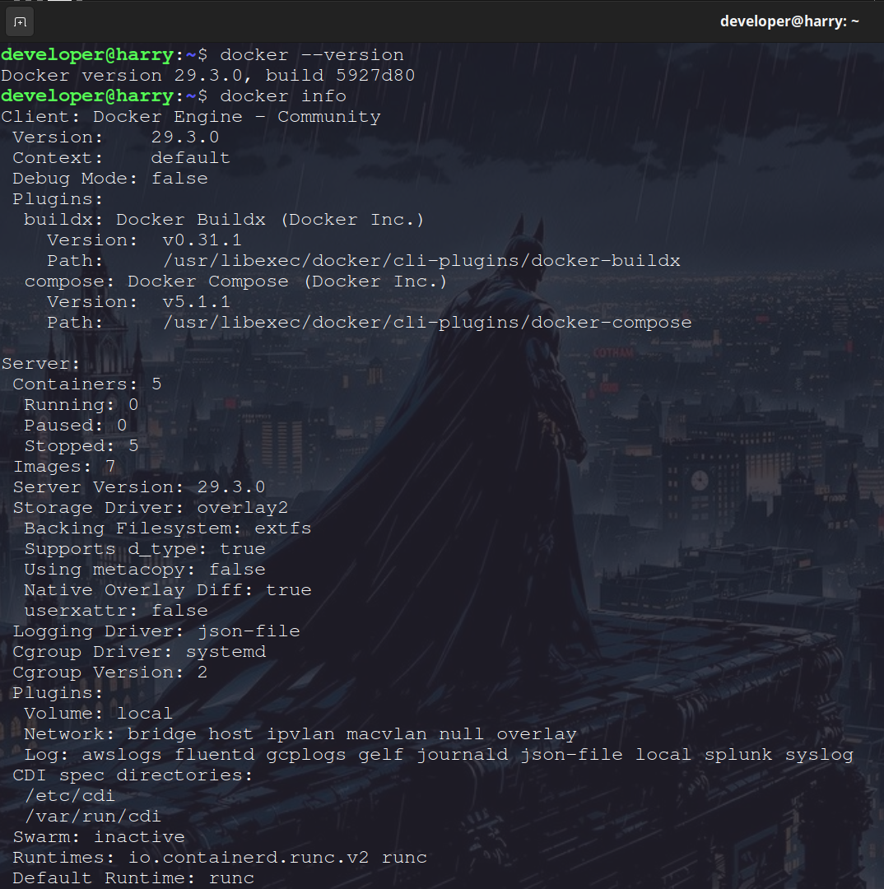
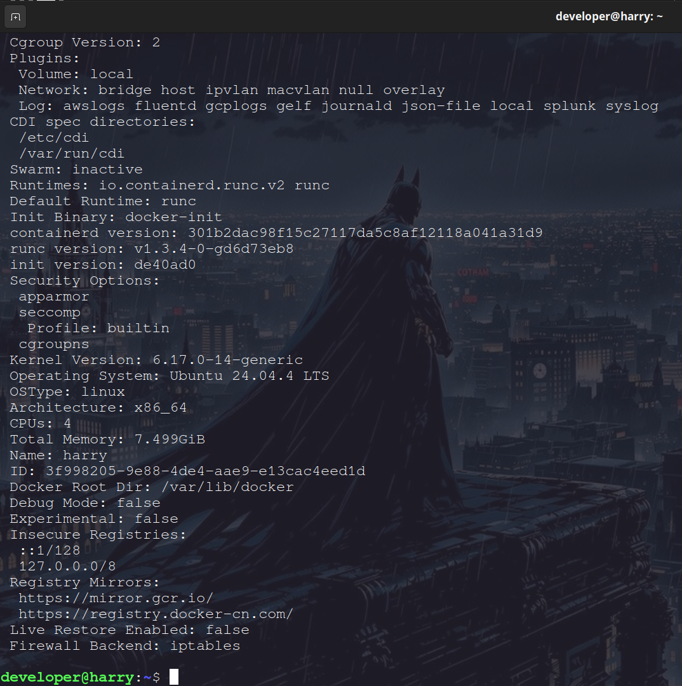
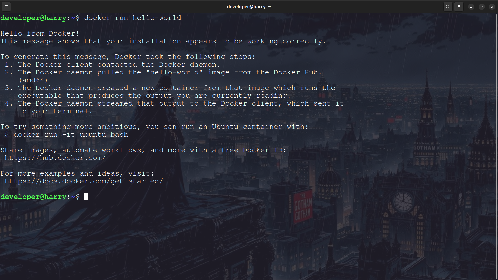
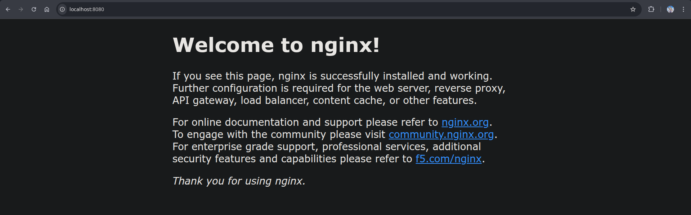
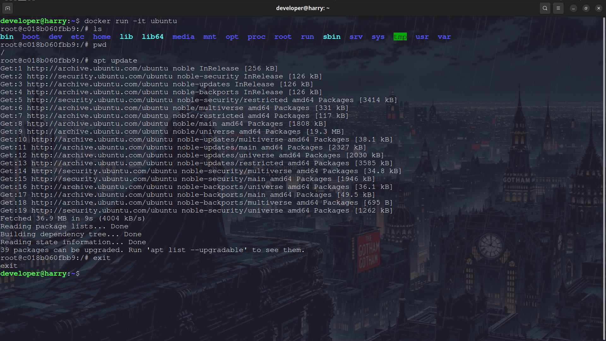
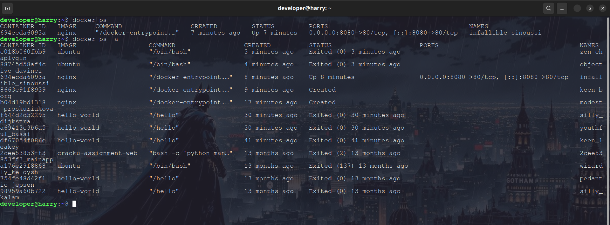
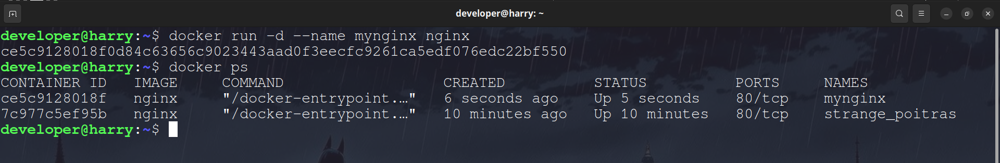
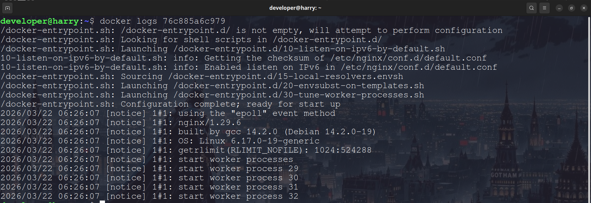
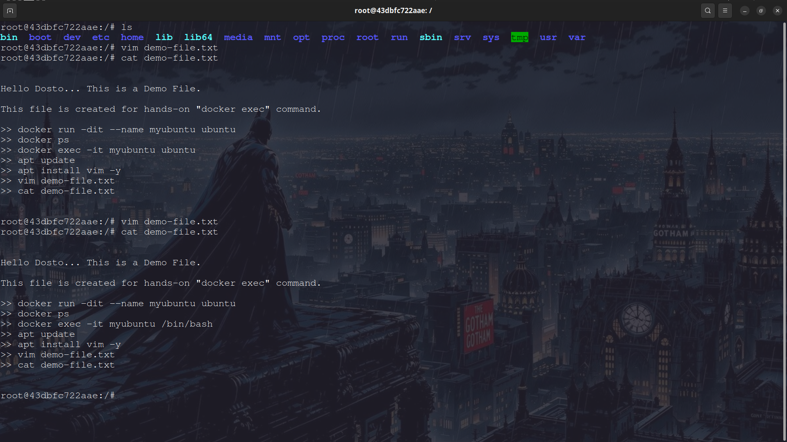

# Task 1: What is Docker?

## What is a Container and Why Do We Need Them?

A container is a lightweight package that includes an application and all its dependencies so it can run consistently across different environments.

### Why containers are needed:

* Eliminates "works on my machine" problem
* Lightweight and fast
* Easy deployment
* Used in CI/CD pipelines
* Same environment everywhere

---

## Containers vs Virtual Machines

| Containers              | Virtual Machines              |
| ----------------------- | ----------------------------- |
| Lightweight             | Heavy                         |
| Share host OS kernel    | Each VM has its own OS        |
| Fast startup            | Slow startup                  |
| Less memory             | More memory                   |
| OS-level virtualization | Hardware-level virtualization |

---

## Docker Architecture

### Components:

* Docker Client
* Docker Daemon
* Docker Images
* Docker Containers
* Docker Registry (Docker Hub)

### Architecture Flow:

Docker Client → Docker Daemon → Docker Hub → Image → Container

**Explanation in simple words:**
When we run a docker command, the client sends a request to the Docker daemon.
The daemon pulls the image from Docker Hub if not available locally, then creates and runs the container.

---

# Task 2: Install Docker

## Install Docker

```bash
sudo apt update
sudo apt install docker.io -y
```

## Start Docker

```bash
sudo systemctl start docker
sudo systemctl enable docker
```

## Verify Installation

```bash
docker --version
docker info
```

### 📸 Screenshot – Docker Version / Info




---

## Run Hello World Container

```bash
docker run hello-world
```

### 📸 Screenshot – Hello World Container Output



---

# Task 3: Run Real Containers

## Run Nginx Container

```bash
docker run -d nginx
```

Open in browser:

```
http://localhost/
```

### 📸 Screenshot – Nginx Running in Browser



---

## Run Ubuntu Container (Interactive Mode)

```bash
docker run -it ubuntu
```

Try commands inside container:

```bash
ls
pwd
apt update
```

Exit:

```bash
exit
```

### 📸 Screenshot – Ubuntu Container Terminal



---

## List Running Containers

```bash
docker ps
```

## List All Containers

```bash
docker ps -a
```

### 📸 Screenshot – docker ps -a



---

## Stop a Container

```bash
docker stop <container_id>
```

---

## Remove a Container

```bash
docker rm <container_id>
```

---

# Task 4: Explore Docker

## Run Container in Detached Mode

Running a container in detached mode means the container runs in the background instead of attaching your terminal to it.

```bash
docker run -d nginx
```

- The container runs in the background
- Terminal is free for other commands
- Container keeps running even if terminal closes

---

## Run Container with Custom Name

```bash
docker run -d --name mynginx nginx
```

### 📸 Screenshot – Named Container



---

## Port Mapping

```bash
docker run -d -p 8080:80 nginx
```

```bash
host_port : container_port
8080      : 80
```

Meaning:
- Port 8080 on your computer
- Is mapped to port 80 inside the container (where nginx runs)

---

## Check Logs

```bash
docker logs <container_id>
```

### 📸 Screenshot – Container Logs



---

## Run Command Inside Running Container

```bash
docker exec -it <container_id> /bin/bash
```

### 📸 Screenshot – Exec into Container



---

# Important Docker Commands Summary

| Command       | Description                  |
| ------------- | ---------------------------- |
| docker run    | Run container                |
| docker ps     | Running containers           |
| docker ps -a  | All containers               |
| docker stop   | Stop container               |
| docker rm     | Remove container             |
| docker images | List images                  |
| docker logs   | View logs                    |
| docker exec   | Run command inside container |

