## Day 30 – Docker Images & Container Lifecycle

---

# Task 1: Docker Images

## Pull Images from Docker Hub

```bash
docker pull <image-name>
```

Pull nginx, ubuntu, and alpine images:

```bash
docker pull nginx
docker pull ubuntu
docker pull alpine
```

## List All Images

```bash
docker images
```

### 📸 Screenshot – Images

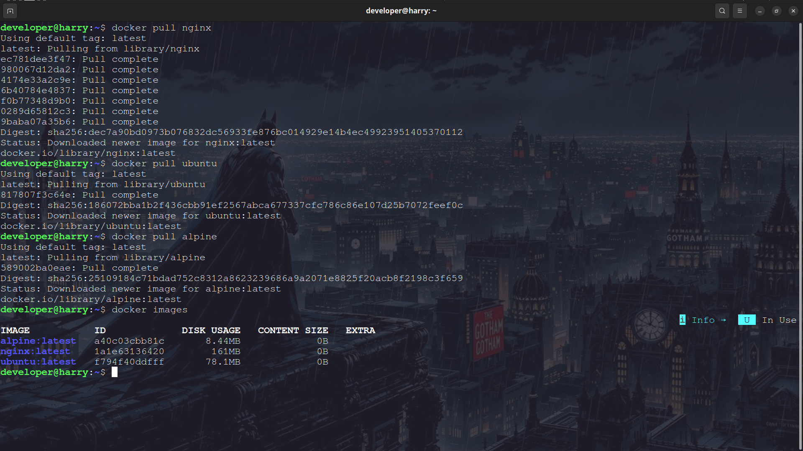

## Ubuntu vs Alpine – Size Difference

| Image  | Size       |
| ------ | ---------- |
| Ubuntu | Large      |
| Alpine | Very Small |

### Why Alpine Is Much Smaller?

* `Ubuntu` - Larger image size because it includes many built‑in tools, libraries, and GNU utilities.
Heavier: slower startup and consumes more resources compared to Alpine.

* `Alpine` - Smaller image size since it contains fewer tools and libraries by default, so you install only what you need.
Lightweight: faster startup, minimal resource usage, ideal for microservices.


**Conclusion:**
`Alpine` is preferred for small, lightweight containers.

---

## Inspect an Image

```bash
docker inspect <image-id>
```

### Inspect Nginx Image

```bash
docker inspect nginx
```

Information you can see:

* Image ID
* Image Tag
* Created Time
* Default Config
    * Ports
    * Environment variables
    * Entrypoint
    * CMD
* Architecture
* OS
* Size
* Graph Driver
* Layers

### 📸 Screenshot – docker inspect nginx

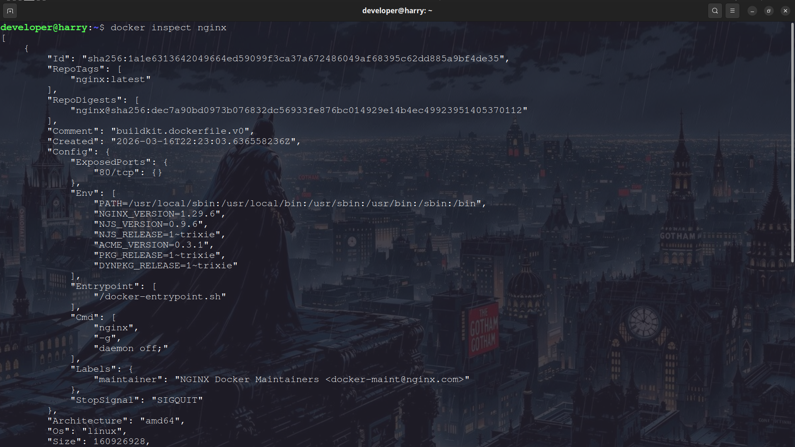
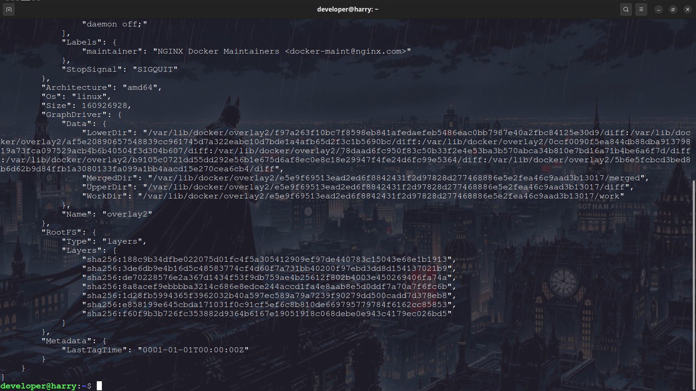

---

## Remove an Image

```bash
docker rmi <image-id>
docker rmi <image-name>
```

### Remove Alpine Image

```bash
docker rmi alpine
```

### 📸 Screenshot – Removing Image

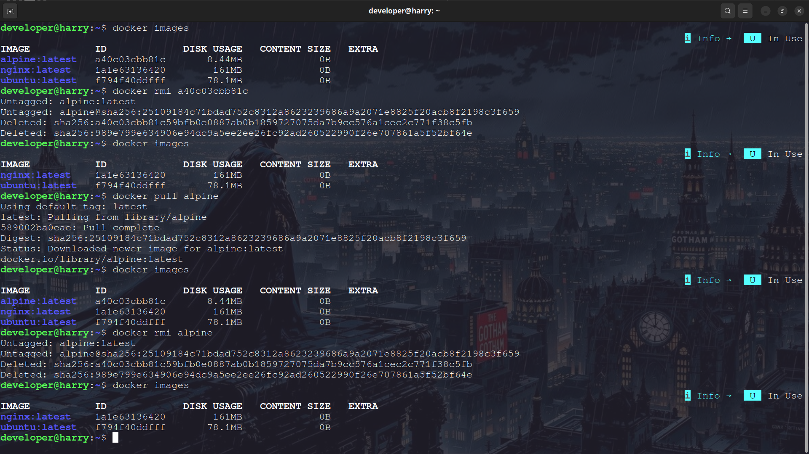

---

# Task 2: Image Layers

## View Image History

```bash
docker image history <image-name>
```

### View Nginx Image's History

```bash
docker image history nginx
```

### 📸 Screenshot – Image History

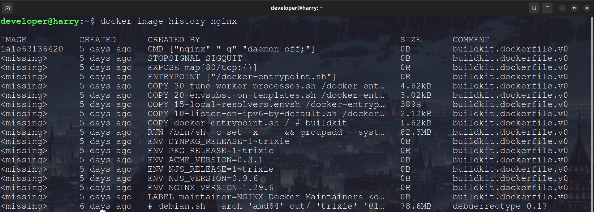

---

## What Are Image Layers?

Docker images are built using **layers**.
Each layer represents a change to the filesystem and is **read-only**.

When Docker builds an image from a Dockerfile:

* Each instruction like `FROM`, `RUN`, `COPY`, `ADD` creates a **new layer**
* Some instructions like `CMD`, `ENTRYPOINT`, `ENV` may create **metadata layers** (very small or 0B)
* Docker **caches layers**, so if nothing changes in a step, Docker reuses the cached layer instead of rebuilding it

This is why **image builds become faster after the first build**.

---

**Docker image layers are:**

* **Read-only**
* **Cached**
* **Reusable**
* **Stacked on top of each other**

When a container runs:

* Docker adds a **thin writable layer** on top of image layers
* All container changes happen in this writable layer

So the structure is actually:

```
Writable Container Layer (Read/Write)
------------------------------------
Image Layer 4
Image Layer 3
Image Layer 2
Image Layer 1
Base OS Layer
```

This is called a **Union File System**.

---

## Why Docker Uses Layers?

Docker uses layers because:

* Faster image builds (layer caching)
* Saves disk space
* Images share common layers
* Faster image downloads (only new layers are pulled)
* Efficient storage
* Easier versioning and rollback

---

### Example of Image Layers

Example Dockerfile:

```dockerfile
FROM ubuntu
RUN apt update
RUN apt install nginx
COPY . /app
CMD ["echo", "Container Started"]
```

This creates layers like:

```
Layer 1: Ubuntu Base Image
Layer 2: apt update
Layer 3: install nginx
Layer 4: copy application files
Layer 5: CMD instruction
```

If you change only the application code:

* Only **Layer 4 and 5 rebuild**
* Layers 1–3 are reused from cache
* Build becomes very fast

---

### One Interview-Level Line

***Docker images are built using layered, read-only filesystem, and containers add a writable layer on top of those image layers.***

---

### Difference Between Image Layer and Container Layer

| Image Layers             | Container Layer             |
| ------------------------ | --------------------------- |
| Read-only                | Writable                    |
| Part of image            | Created when container runs |
| Shared across containers | Unique per container        |
| Cached                   | Not cached                  |
| Immutable                | Mutable                     |

---

## Short Summary

```
Docker Image = Multiple Read-Only Layers
Docker Container = Image Layers + Writable Layer

Layers help with:
- Caching
- Faster builds
- Less storage usage
- Layer reuse
- Faster downloads
```

---

# Task 3: Container Lifecycle

Practice the full lifecycle on one container:

1. **Create** a container (without starting it)
2. **Start** the container
3. **Pause** it and check status
4. **Unpause** it
5. **Stop** it
6. **Restart** it
7. **Kill** it
8. **Remove** it

Check `docker ps -a` after each step — observe the changed state.

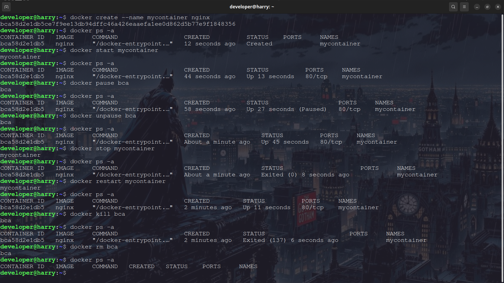

---

# Task 4: Working with Running Containers

## Run Nginx Container in Detached Mode

```bash
docker run -d --name nginx-server -p 81:80 nginx
```

### 📸 Screenshot – Detached Nginx Container

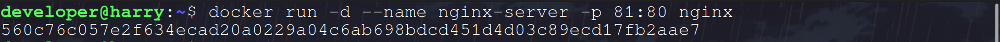

---

## View Logs

```bash
docker logs nginx-server
```

### 📸 Screenshot – Container Logs

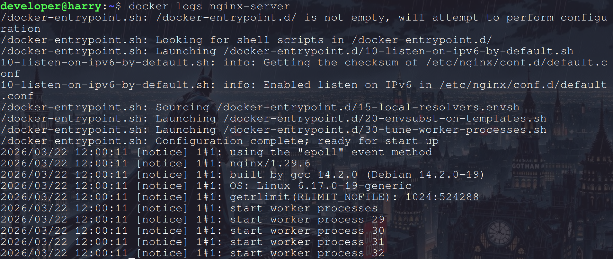

---

## View Real-Time Logs (Follow Mode)

```bash
docker logs -f nginx-server
```

### 📸 Screenshot – Real-Time Logs

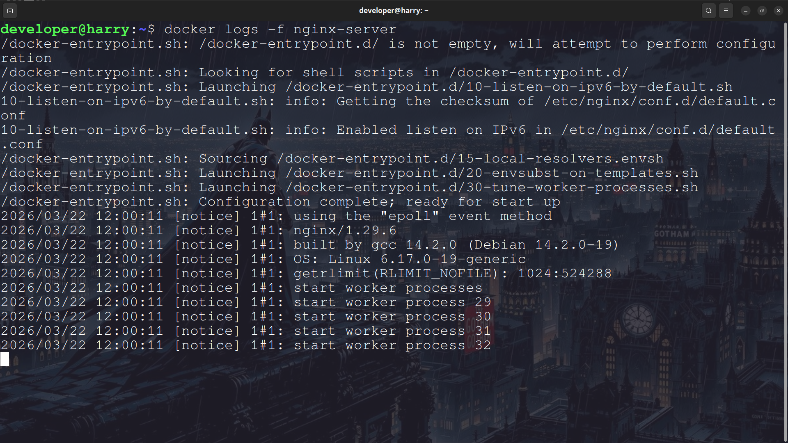

---

## Exec Into Running Container

```bash
docker exec -it nginx-server /bin/bash
```

Try inside container:

```bash
ls
cd /usr/share/nginx/html
cat index.html
```

### 📸 Screenshot – Exec Into Container

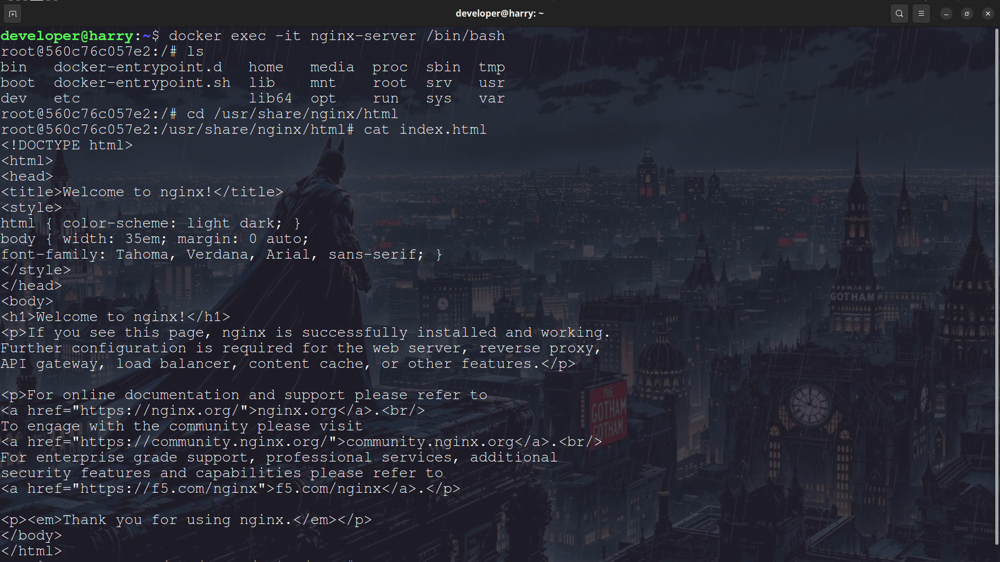

---

## Run Single Command Inside Container

```bash
docker exec nginx-server ls /
```

### 📸 Screenshot – Exec Single Command

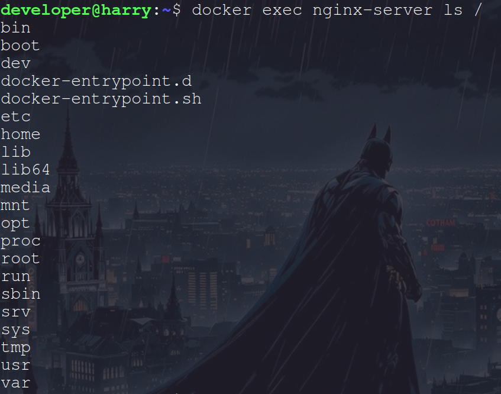

---

## Inspect Container

```bash
docker inspect nginx-server
```

Find:

* IP Address
* Port mappings
* Mounts

### 📸 Screenshot – Inspect Container

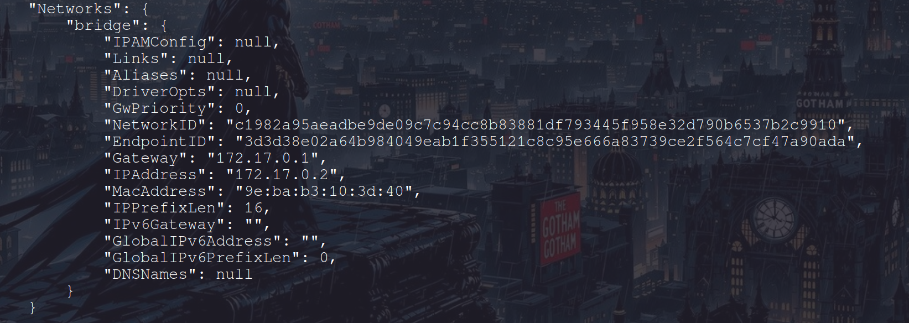
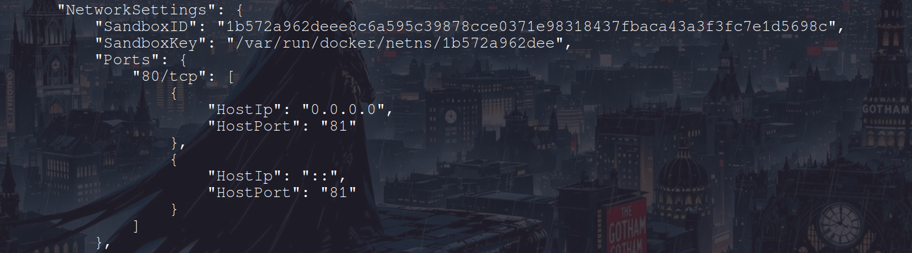


---

# Task 5: Cleanup

## Stop All Running Containers

```bash
docker stop $(docker ps -q)
```

### 📸 Screenshot – Stop All Containers

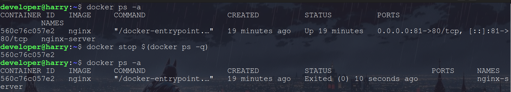

---

## Remove All Stopped Containers

```bash
docker rm $(docker ps -qa)
docker container prune
```

### 📸 Screenshot – Remove Stopped Containers

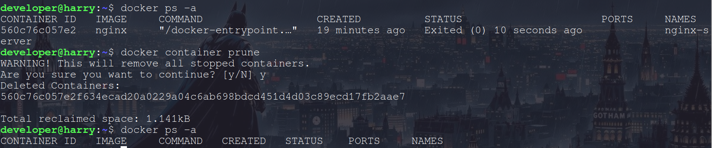

---

## Remove Unused Images

```bash
docker rmi $(docker image -qa)
```

### 📸 Screenshot – Remove Images

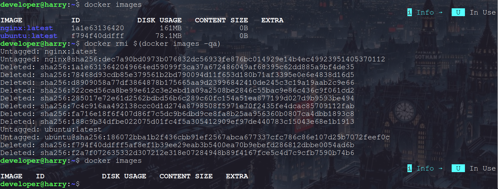

---

## Check Docker Disk Usage

```bash
docker system df
```

### 📸 Screenshot – Docker Disk Usage

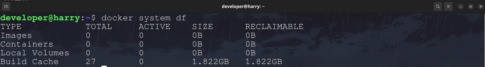

---

## Relationship Between Image and Container

**Image = Blueprint**
**Container = Running Instance of Image**

Example:

```
Docker Image → docker run → Container
```

One image can create multiple containers.
