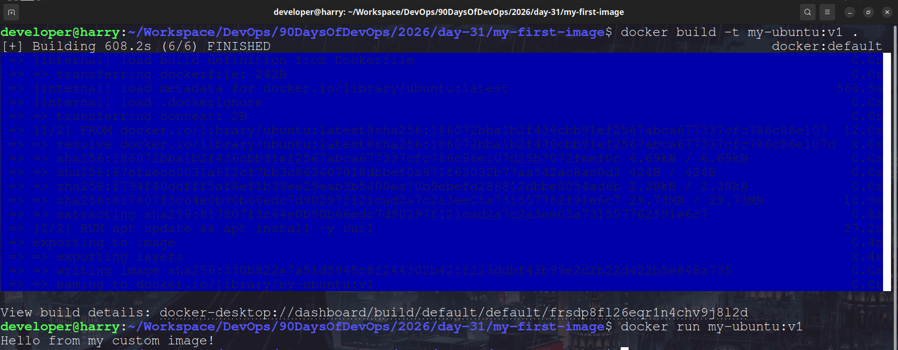
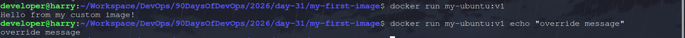
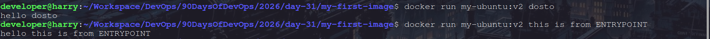
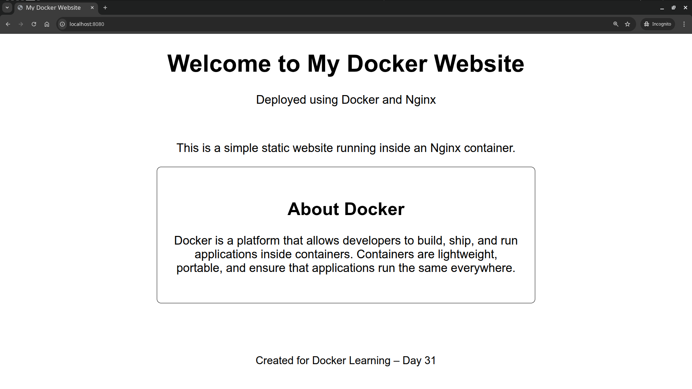
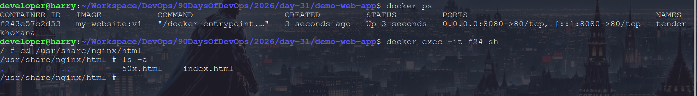

## Day 31 – Dockerfile: Build Your Own Images

---

# Task 1: Your First Dockerfile

## Step 1 – Create Project Folder

```bash
mkdir my-first-image
cd my-first-image
```

---

## Step 2 – Create Dockerfile

Create a file named **Dockerfile** (no extension) - *[View Dockerfile](./my-first-image//Dockerfile)*

```dockerfile
FROM ubuntu
RUN apt update && apt install -y curl
CMD ["echo", "Hello from my custom image!"]
```

---

## Step 3 – Build the Image

```bash
docker build -t my-ubuntu:v1 .
```

---

## Step 4 – Run Container From Image
 
```bash
docker run my-ubuntu:v1
```

You should see:

```
Hello from my custom image!
```

### 📸 Screenshot – Running Custom Image



---

# Task 2: Dockerfile Instructions

Create a file **Dockerfile** - *[View Dockerfile](./dockerfile-demo/Dockerfile)*

```dockerfile
FROM ubuntu
RUN apt update && apt install -y curl
WORKDIR /app
COPY . .
EXPOSE 8080
CMD ["echo", "Dockerfile Demo Running"]
```

## Build Image

```bash
docker build -t dockerfile-demo:v1 .
```

---

## Run Container

```bash
docker run dockerfile-demo:v1
```

### 📸 Screenshot – Run Dockerfile Demo Container

(Insert screenshot here)

---

## What Each Instruction Does

| Instruction | Purpose                               |
| ----------- | ------------------------------------- |
| FROM        | Base image                            |
| RUN         | Execute command during build          |
| COPY        | Copy files from host to image         |
| WORKDIR     | Set working directory                 |
| EXPOSE      | Document container port               |
| CMD         | Default command when container starts |

---

# Task 3: CMD vs ENTRYPOINT (Using Same Dockerfile)

Original Dockerfile from Task 1:

```dockerfile
FROM ubuntu
RUN apt update && apt install -y curl
CMD ["echo", "Hello from my custom image!"]
```

You built image:

```bash
docker build -t my-ubuntu:v1 .
```

---

## Part 1 – CMD Behavior

Run normally:

```bash
docker run my-ubuntu:v1
```

Output:

```
Hello from my custom image!
```

Now override the CMD:

```bash
docker run my-ubuntu:v1 echo "Override message"
```

Output:

```
Override message
```

### Observation

**CMD can be overridden from the docker run command.**

So:

```
CMD = Default command
```

📸 Screenshot – CMD Override



---

## Part 2 – ENTRYPOINT Behavior

```dockerfile
FROM ubuntu
RUN apt update && apt install -y curl
ENTRYPOINT ["echo"]
CMD ["echo","Hello from my custom image!"]
```

Rebuild image:

```bash
docker build -t my-ubuntu:v2 .
```

Run container:

```bash
docker run my-ubuntu:v2 hello
```

Output:

```
hello
```

Run again:

```bash
docker run my-ubuntu:v2 message displayed by ENTRYPOINT
```

Output:

```
message displayed by ENTRYPOINT
```

### Observation

ENTRYPOINT **cannot be overridden**.
Anything you pass in `docker run` is appended as arguments.

So:

```
ENTRYPOINT = Fixed command
CMD = Default arguments
```

📸 Screenshot – ENTRYPOINT



---

## Using CMD and ENTRYPOINT together

```dockerfile
FROM ubuntu
ENTRYPOINT ["echo"]
CMD ["Hello"]
```

Build:

```bash
docker build -t combined-image .
```

Run:

```bash
docker run combined-image
```

Output:

```
Hello
```

Run:

```bash
docker run combined-image Docker World
```

Output:

```
Docker World
```

### Meaning:

```
ENTRYPOINT = command
CMD = default arguments
```

This is **very commonly used in real Docker images**.

---

## CMD vs ENTRYPOINT

| CMD                | ENTRYPOINT                        |
| ------------------ | --------------------------------- |
| Default command    | Main command                      |
| Can be overridden  | Cannot be overridden              |
| Used for defaults  | Used for fixed container behavior |
| Arguments replaced | Arguments appended                |

### Simple Rule to Remember

```
CMD → Default command
ENTRYPOINT → Fixed command
ENTRYPOINT + CMD → Command + Default arguments
```

---

## One-Line Interview Answer

> CMD sets the default command that can be overridden, while ENTRYPOINT sets the main container command and CMD is used as default arguments to ENTRYPOINT.

---

# Task 4: Build a Simple Web App Image

1. Create a small static HTML file (`index.html`) with any content - *[View Index File](./demo-web-app/index.html)*
2. Write a Dockerfile that:
    * Uses `nginx:alpine` as base
    * Copies your `index.html` to the Nginx web directory
3. Build and tag it `my-website:v1`
4. Run it with port mapping and access it in your browser

### 📸 Screenshot – Website Running in Browser



---

# Task 5: .dockerignore

Create a file:

```
.dockerignore
```

Add:

```
node_modules
.git
*.md
.env
```

This prevents unnecessary files from being copied into the image - *[View `.dockerignore` File](./demo-web-app/.dockerignore)

### 📸 Screenshot – Build with .dockerignore



---

# Task 6: Build Optimization (Layer Caching)

## Why Order Matters?

* Docker builds images in layers. Each instructions (FROM, COPY, RUN) creates a new layer.
* Docker caches layers, so all layers before any unchanged instruction is not rebuilt, used from cache.
* If a layer changes, all layers after it are rebuilt.
* Placing frequently changing layers last, ensures maximum use of cache and minimum rebuild time.
* Provides faster and efficient builds.