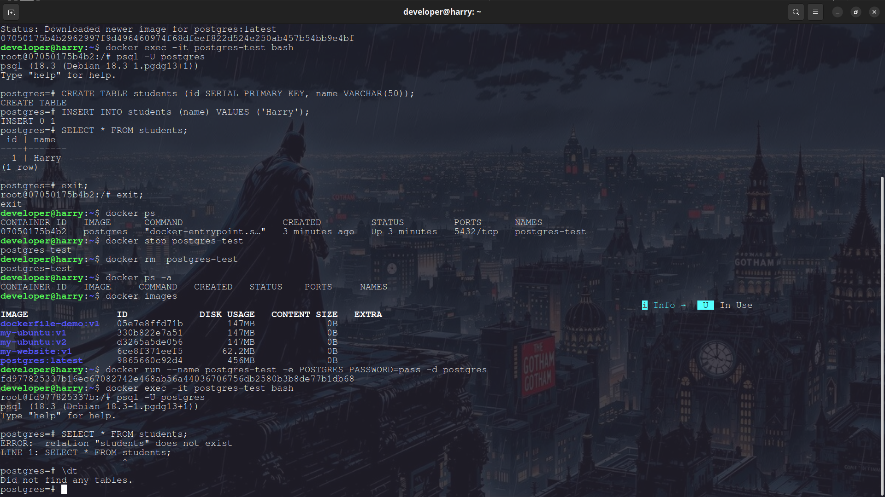
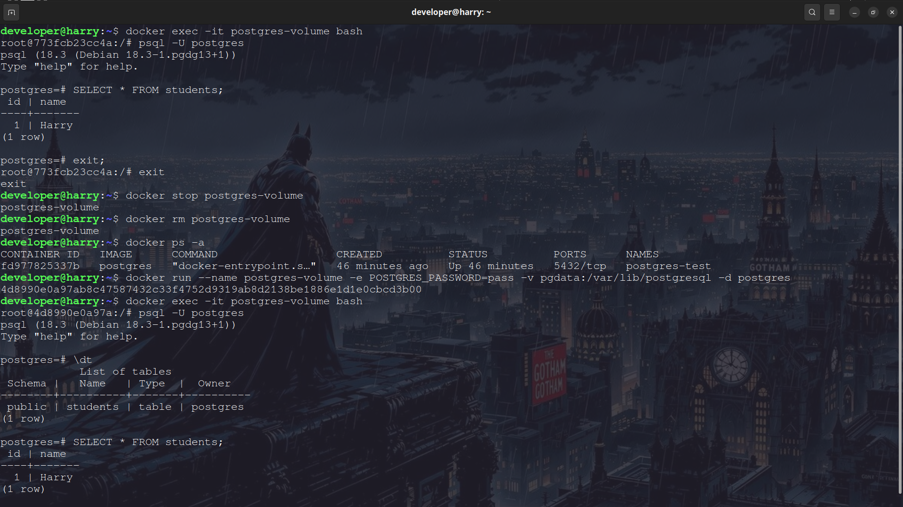
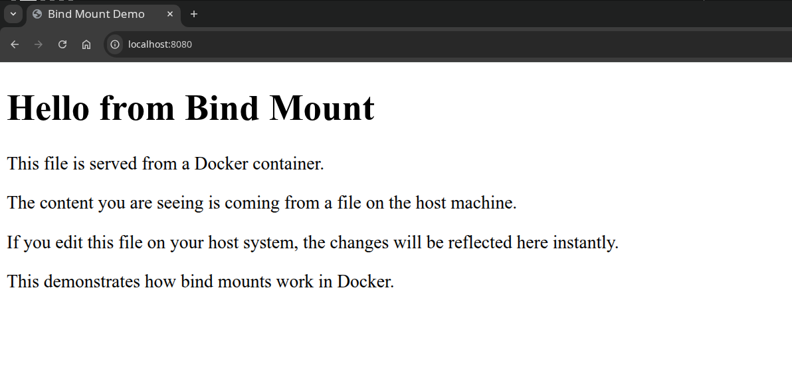
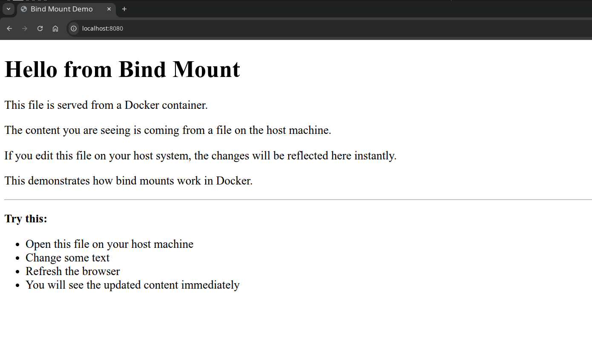
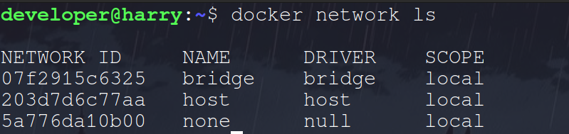
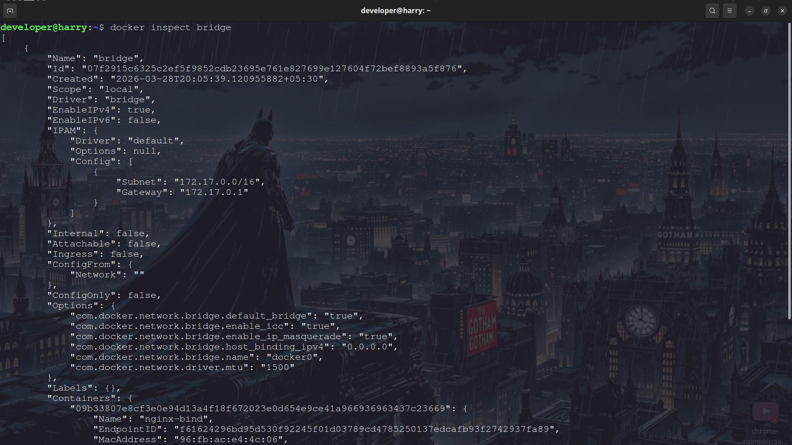
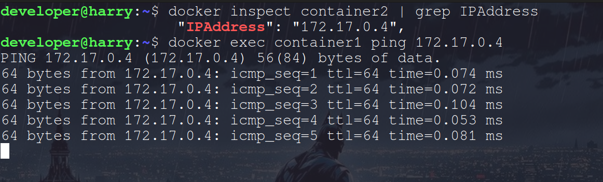
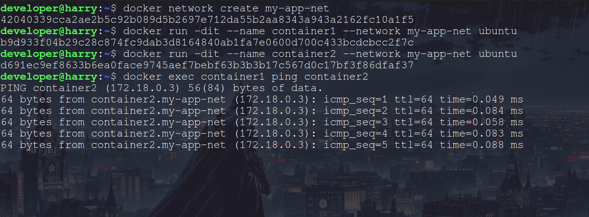
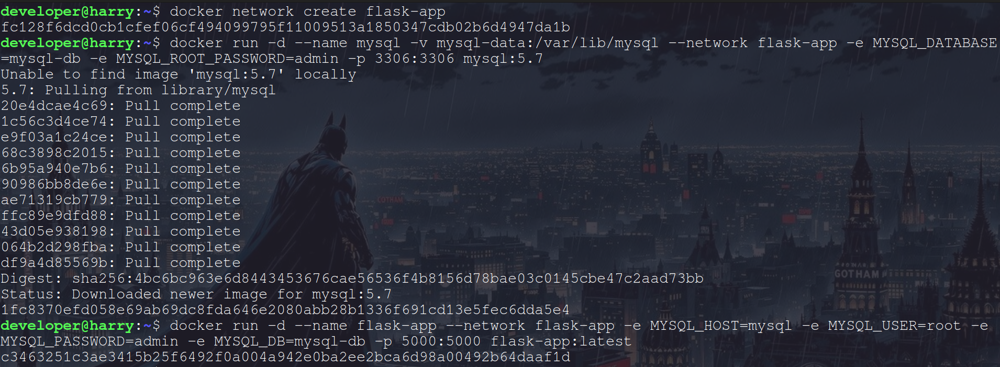
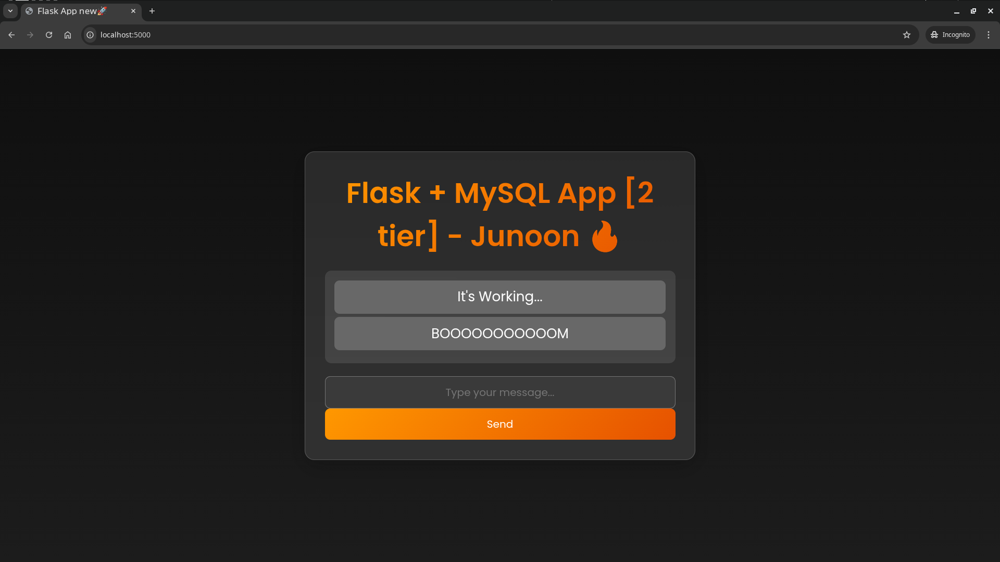

# Day 32 – Docker Volumes & Networking

## Overview

Today’s goal was to solve two major Docker problems:

1. **Data persistence**
2. **Container communication**

Containers are ephemeral, meaning when a container is removed, its data is lost. Docker volumes solve this problem. Docker networks allow containers to communicate with each other.

---

# Task 1 – The Problem (Data Loss Without Volumes)

## Step 1: Run Postgres Container

```bash
docker run --name postgres-test -e POSTGRES_PASSWORD=pass -d postgres
```

## Step 2: Enter Container

```bash
docker exec -it postgres-test bash
```

## Step 3: Open Postgres

```bash
psql -U postgres
```

## Step 4: Create Table

```sql
CREATE TABLE students (
    id SERIAL PRIMARY KEY,
    name VARCHAR(50)
);
INSERT INTO students (name) VALUES ('Harry');
SELECT * FROM students;
```

## Step 5: Remove Container

```bash
docker stop postgres-test
docker rm postgres-test
```

## Step 6: Run New Container

```bash
docker run --name postgres-test -e POSTGRES_PASSWORD=pass -d postgres
```

## Result

The table and data were **gone**.

## Why?

Because container storage is **ephemeral**. When the container was removed, its filesystem was deleted.

## Screenshot - Data Loss Without Volumes



---

# Task 2 – Named Volumes (Data Persistence)c

## Step 1: Create Volume

```bash
docker volume create pgdata
```

## Step 2: Run Container With Volume

```bash
docker run --name postgres-volume \
-e POSTGRES_PASSWORD=pass \
-v pgdata:/var/lib/postgresql \
-d postgres
```

## Step 3: Create Table Again

## Step 4: Remove Container

```bash
docker stop postgres-volume
docker rm postgres-volume
```

## Step 5: Run New Container With Same Volume

```bash
docker run --name postgres-volume \
-e POSTGRES_PASSWORD=pass \
-v pgdata:/var/lib/postgresql \
-d postgres
```

## Result

The data was **still there**.

## Verify Volumes

```bash
docker volume ls
docker volume inspect pgdata
```

## Conclusion

Named volumes persist data even if containers are removed.

## Screenshot - Data Persistence


---

# Task 3 – Bind Mounts

## Step 1: Create Folder

```bash
mkdir nginx-html
cd nginx-html
```

## Step 2: Create index.html

```html
<!DOCTYPE html>
<html>
<head>
    <title>Bind Mount Demo</title>
</head>
<body>
    <h1>hello from bind mount</h1>
</body>
</html>
```

## Step 3: Run Nginx Container

```bash
docker run -d \
-p 8080:80 \
-v $(pwd):/usr/share/nginx/html \
--name nginx-bind \
nginx
```

## Step 4: Open Browser

```
http://localhost:8080
```

## Step 5: Edit index.html on Host

Refresh browser → Changes appear instantly.

---

## Named Volume vs Bind Mount

| Named Volume               | Bind Mount              |
| -------------------------- | ----------------------- |
| Managed by Docker          | Uses host folder        |
| Stored in Docker directory | Stored anywhere on host |
| Best for databases         | Best for code/web files |
| Harder to access directly  | Easy to edit files      |
| Portable                   | Host dependent          |

## Screenshot - Bind Mounts Example





---

# Task 4 – Docker Networking Basics

## List Networks

```bash
docker network ls
```


## Inspect Bridge Network

```bash
docker network inspect bridge
```



## Run Two Containers

```bash
docker run -dit --name container1 ubuntu
docker run -dit --name container2 ubuntu
```

## Ping by Name

```bash
docker exec container1 ping container2
```

Result: **Does not work**


## Ping by IP

```bash
docker inspect container2 | grep IPAddress
docker exec container1 ping <IP>
```

Result: **Works**



## Conclusion

Default bridge network does not support name-based DNS.

---

# Task 5 – Custom Networks

## Create Custom Network

```bash
docker network create my-app-net
```

## Run Containers on Custom Network

```bash
docker run -dit --name container1 --network my-app-net ubuntu
docker run -dit --name container2 --network my-app-net ubuntu
```

## Ping by Name

```bash
docker exec container1 ping container2
```

Result: **Works**

## Why?

Custom bridge networks have **built-in DNS** for container name resolution.

## Screenshot - Custom Network



---

# Task 6 – Put It Together (App + Database)

[Two Tier Flask App](./two-tier-flask-app/)

## Step 1: Create Network

```bash
docker network create flask-app
```

## Step 2: Create Volume

```bash
docker volume create mysql-data
```

## Step 3: Run MySQL Container

```bash
docker run -d \
    --name mysql \
    -v mysql-data:/var/lib/mysql \
    --network flask-app \
    -e MYSQL_DATABASE=mysql-db \
    -e MYSQL_ROOT_PASSWORD=admin \
    -p 3306:3306 \
    mysql:5.7
```

## Step 4: Run App Container

```bash
docker run -d \
    --name flask-app \
    --network flask-app \
    -e MYSQL_HOST=mysql \
    -e MYSQL_USER=root \
    -e MYSQL_PASSWORD=admin \
    -e MYSQL_DB=mysql-db \
    -p 5000:5000 \
    flaskapp:latest
```

## Step 5: Test Connection

```bash
docker exec flask-app ping mysql
```

Result: **Success — containers communicate using container name**

## Screenshot - Two Tier Flask App 





---

# Final Summary

## Docker Volumes

* Containers lose data when removed
* Named volumes persist data
* Bind mounts link host folders to containers

## Docker Networks

* Default bridge → IP communication only
* Custom bridge → Name + IP communication
* Best practice → Always use custom networks for multi-container apps
