# Day 33 – Docker Compose: Multi-Container Basics

## Overview 

Today's goal is to run **multi-container applications with a single command** using Docker Compose.

Docker Compose allows us to define services, networks, and volumes in a single YAML file and manage everything together.

---

# Task 1 – Install & Verify Docker Compose

## Check if Docker Compose is installed

```bash
docker compose version
```


## Verify Docker Compose

```bash
docker compose
```

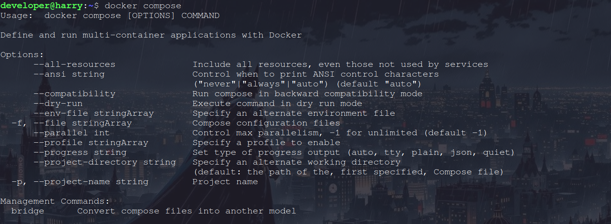
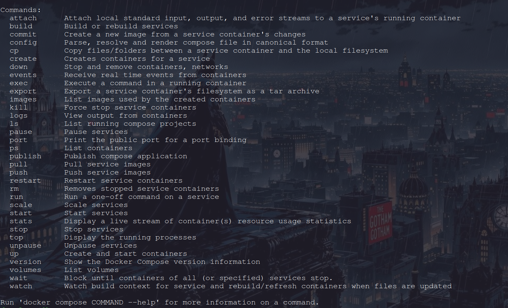

---

# Task 2 – First Compose File (Nginx)

## Step 1 – Create Folder

```bash
mkdir compose-basics
cd compose-basics
```

## Step 2 – Create docker-compose.yml

```yaml
services:
  nginx:
    image: nginx:latest
    ports:
      - "8080:80"
```

## Step 3 – Start Container

```bash
docker compose up
```

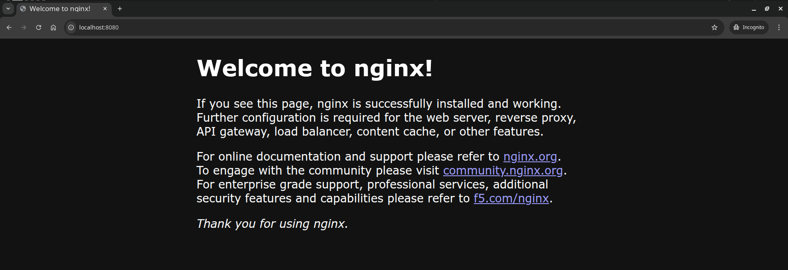

## Step 4 – Stop Containers

```bash
docker compose down
```

---

# Task 3 – Two Container Setup (WordPress + MySQL)

## docker-compose.yml

```yaml
services:
  db:
    image: mysql:5.7
    environment:
      MYSQL_DATABASE: wordpress
      MYSQL_USER: wordpress
      MYSQL_PASSWORD: wordpress
      MYSQL_ROOT_PASSWORD: rootpassword
    volumes:
      - db_data:/var/lib/mysql

  wordpress:
    image: wordpress
    ports:
      - "8081:80"
    environment:
      WORDPRESS_DB_HOST: db
      WORDPRESS_DB_USER: wordpress
      WORDPRESS_DB_PASSWORD: wordpress
      WORDPRESS_DB_NAME: wordpress
    depends_on:
      - db

volumes:
  db_data:
```

## Start Services

```bash
docker compose up -d
```

Open `http://localhost:8081` in your browser and complete WordPress setup.

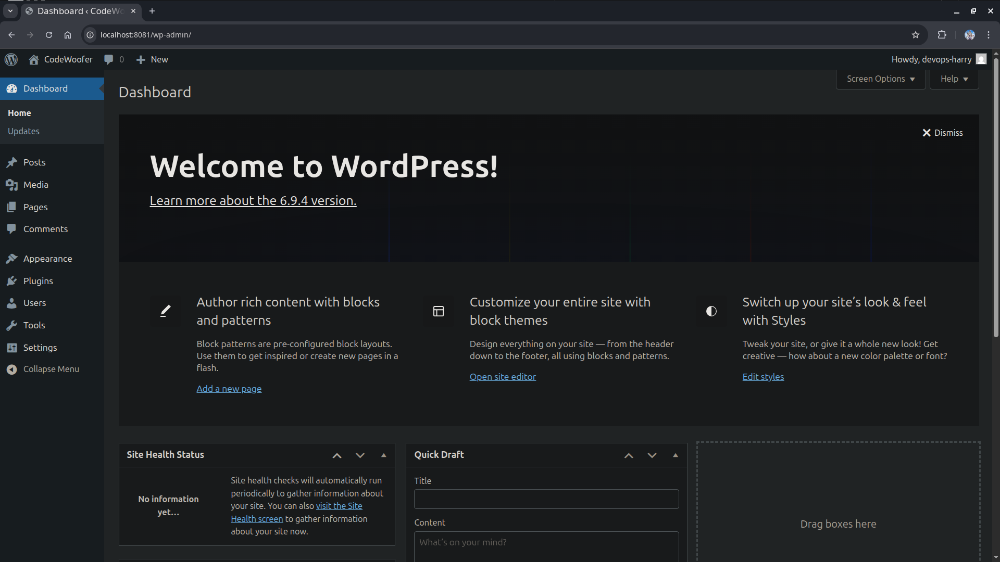

## Test Data Persistence

```bash
docker compose down
docker compose up -d
```

Your WordPress site and data should still be there because of the named volume `db_data`.

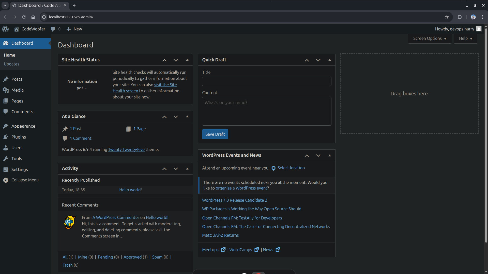

---

# Task 4 – Docker Compose Commands

## Start services in detached mode

```bash
docker compose up -d
```

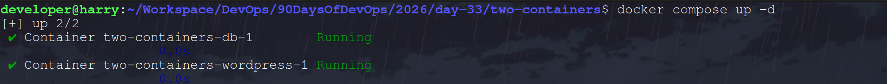

## View running services

```bash
docker compose ps
```

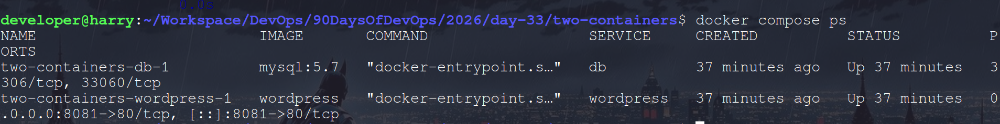

## View logs of all services

```bash
docker compose logs
```

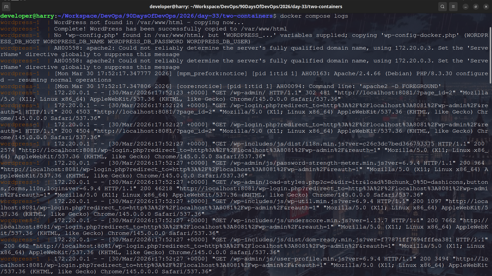

## View logs of specific service

```bash
docker compose logs wordpress
```

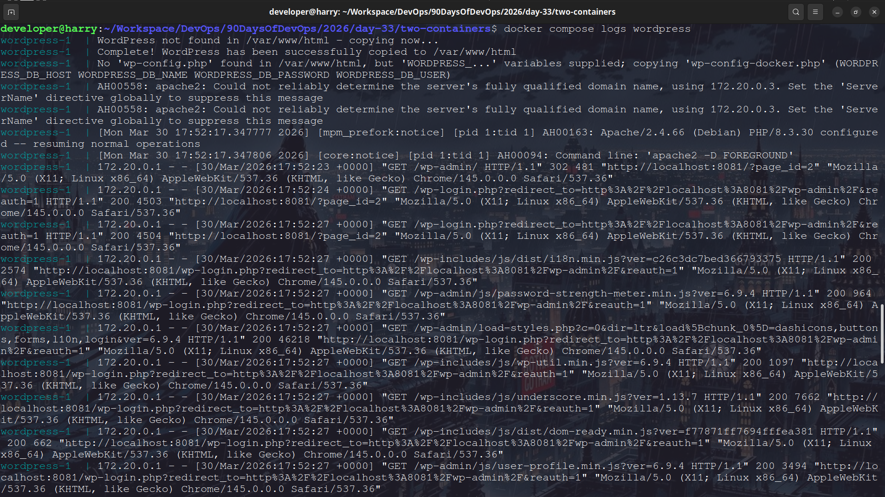

## Stop services without removing

```bash
docker compose stop
```


## Remove everything (containers, networks)

```bash
docker compose down
```

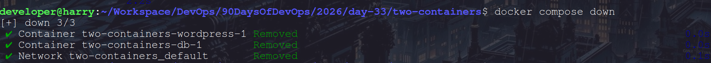

## Rebuild images

```bash
docker compose up --build
```

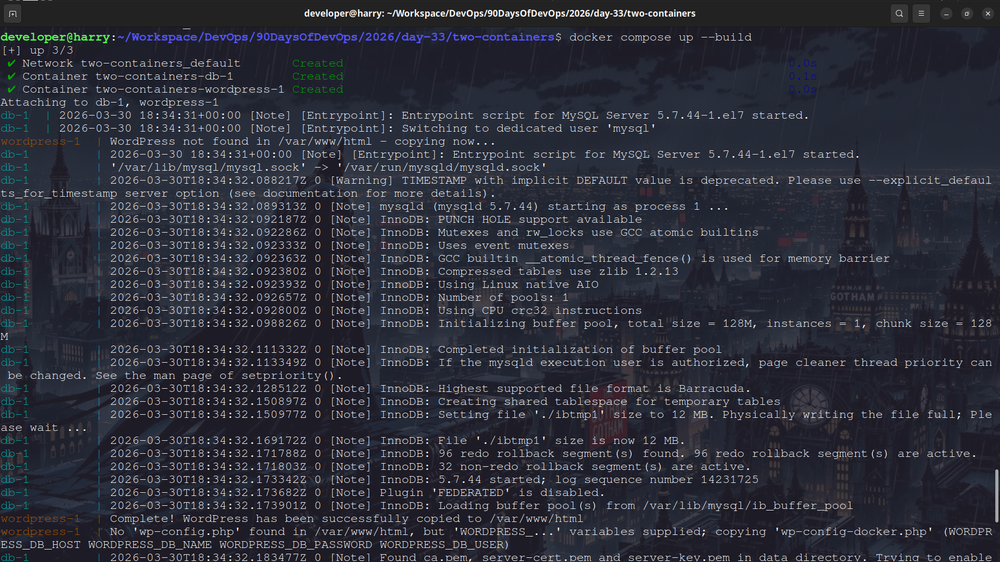

---

# Task 5 – Environment Variables

## Using environment variables in docker-compose.yml

```yaml
services:
  db:
    image: mysql:5.7
    environment:
      MYSQL_DATABASE: wordpress
      MYSQL_USER: wordpress
      MYSQL_PASSWORD: wordpress
      MYSQL_ROOT_PASSWORD: rootpassword
    volumes:
      - db_data:/var/lib/mysql

  wordpress:
    image: wordpress
    ports:
      - "8081:80"
    environment:
      WORDPRESS_DB_HOST: db
      WORDPRESS_DB_USER: wordpress
      WORDPRESS_DB_PASSWORD: wordpress
      WORDPRESS_DB_NAME: wordpress
    depends_on:
      - db
```

## Using .env file

### Create `.env`

```
MYSQL_DATABASE=wordpress
MYSQL_USER=wordpress
MYSQL_PASSWORD=wordpress
MYSQL_ROOT_PASSWORD=rootpassword

WORDPRESS_DB_HOST=db
WORDPRESS_DB_USER=wordpress
WORDPRESS_DB_PASSWORD=wordpress
WORDPRESS_DB_NAME=wordpress
```

### Update docker-compose.yml

```yaml
services:
  db:
    image: mysql:5.7
    environment:
      MYSQL_DATABASE: ${MYSQL_DATABASE}
      MYSQL_USER: ${MYSQL_USER}
      MYSQL_PASSWORD: ${MYSQL_PASSWORD}
      MYSQL_ROOT_PASSWORD: ${MYSQL_ROOT_PASSWORD}
    volumes:
      - db_data:/var/lib/mysql

  wordpress:
    image: wordpress
    ports:
      - "8081:80"
    environment:
      WORDPRESS_DB_HOST: ${WORDPRESS_DB_HOST}
      WORDPRESS_DB_USER: ${WORDPRESS_DB_USER}
      WORDPRESS_DB_PASSWORD: ${WORDPRESS_DB_PASSWORD}
      WORDPRESS_DB_NAME: ${WORDPRESS_DB_NAME}
    depends_on:
      - db
```

## Verify Environment Variables

```bash
docker compose config
```

This command shows the fully rendered compose file with environment variables substituted.

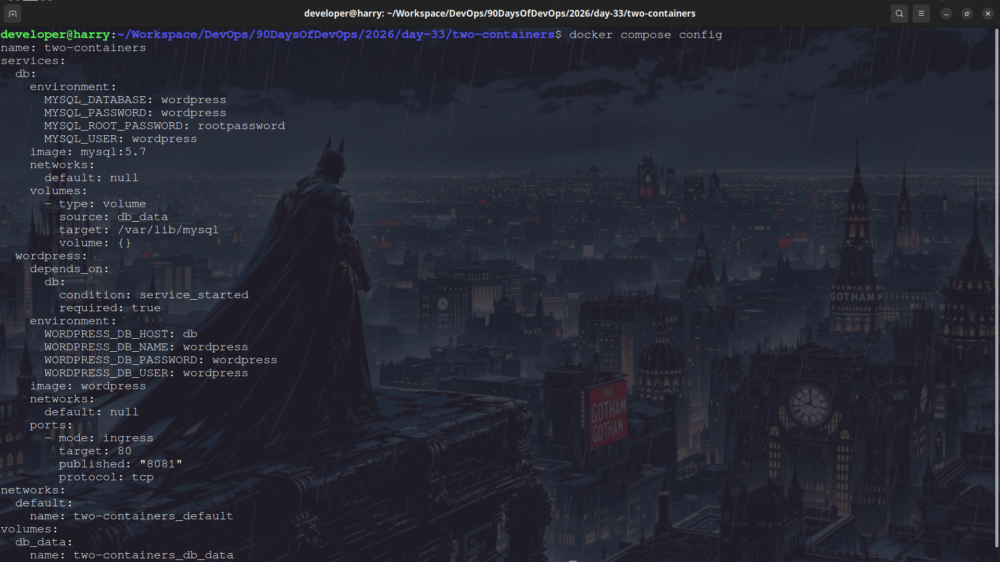

---

# Key Learnings

* Docker Compose runs multi-container apps
* One YAML file defines services, volumes, and networks
* Compose automatically creates a network
* Service names act as DNS hostnames
* Named volumes persist data
* `.env` files store environment variables
* `docker compose up` starts everything
* `docker compose down` removes everything
