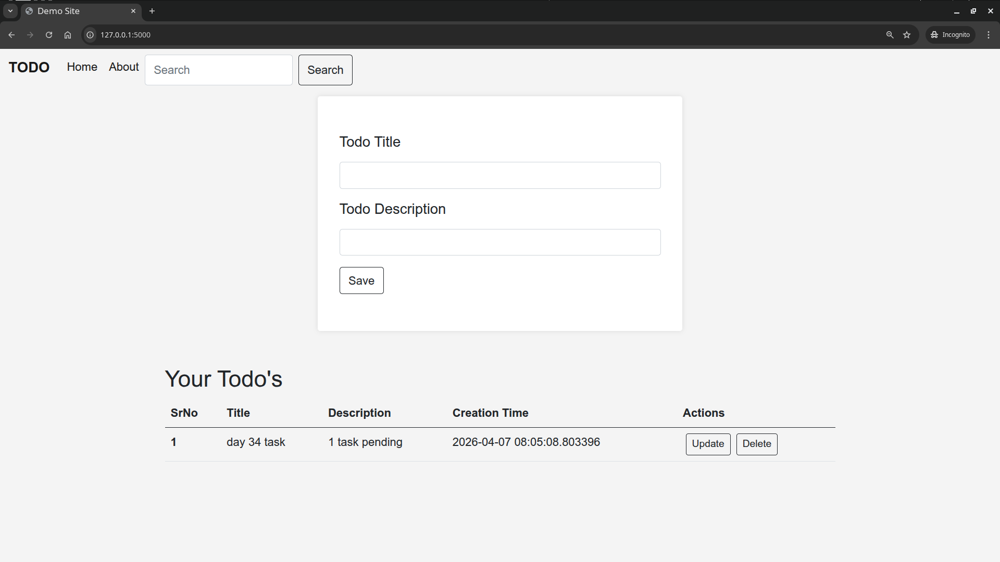

# Day 34 – Docker Compose: Real-World Multi-Container Apps

## Overview

Today we built a **production-like multi-container application** using Docker Compose with:

* Flask Web App
* PostgreSQL Database
* Redis Cache
* Healthchecks
* Restart Policies
* Named Volumes
* Custom Networks
* Scaling

Used the [**Flask Todo App**](./todo-app) and modified it to work with PostgreSQL and Redis instead of SQLite. 

---



---

# Task 1 – Multi-Service App Stack

## Dockerfile (Flask App)

Create `app/Dockerfile` - [Docker File](./todo-app/Dockerfile)

```dockerfile
FROM python:3.11-slim

WORKDIR /app

COPY requirements.txt .
RUN pip install --no-cache-dir -r requirements.txt

COPY . .

EXPOSE 5000

CMD ["python", "app.py"]
```

---

# docker-compose.yml

Create `app/docker-compose.yml` - [Docker Compose File](./todo-app/docker-compose.yml)

```yaml
services:
  web:
    build: .
    container_name: flask_app
    ports:
      - "5000:5000"
    depends_on:
      db:
        condition: service_healthy
    environment:
      DB_HOST: db
      DB_NAME: todo_db
      DB_USER: postgres
      DB_PASS: postgres
      REDIS_HOST: redis
    networks:
      - app_network
    labels:
      - "project=todo-app"
      - "service=web"

  db:
    image: postgres:15
    container_name: postgres_db
    restart: always
    environment:
      POSTGRES_USER: postgres
      POSTGRES_PASSWORD: postgres
      POSTGRES_DB: todo_db
    volumes:
      - postgres_data:/var/lib/postgresql/data
    networks:
      - app_network
    healthcheck:
      test: ["CMD-SHELL", "pg_isready -U postgres"]
      interval: 10s
      timeout: 5s
      retries: 5
    labels:
      - "project=todo-app"
      - "service=db"

  redis:
    image: redis:7
    container_name: redis_cache
    networks:
      - app_network
    labels:
      - "project=todo-app"
      - "service=redis"

volumes:
  postgres_data:

networks:
  app_network:
```

---

# Task 2 – depends_on & Healthchecks

We used:

* `depends_on`
* PostgreSQL `healthcheck`
* Web container waits until database is ready

Test:

```
docker compose down
docker compose up
```

---

# Task 3 – Restart Policies

Restart policies comparison:

| Policy         | Behavior                          |
| -------------- | --------------------------------- |
| no             | Never restart                     |
| always         | Always restart container          |
| on-failure     | Restart only if container crashes |
| unless-stopped | Restart unless manually stopped   |

When to use:

* always → Databases
* on-failure → Workers
* unless-stopped → Local development
* no → Debugging

Test restart:

```
docker kill postgres_db
```

---

# Task 4 – Custom Dockerfiles in Compose

Instead of using prebuilt images:

```
web:
  build: .
```

Rebuild after code changes:

```
docker compose up --build
```

---

# Task 5 – Named Networks & Volumes

## Named Volume

```
volumes:
  postgres_data:
```

Used to persist PostgreSQL data.

## Named Network

```
networks:
  app_network:
```

Containers communicate using service names:

* db
* redis
* web

---

# Task 6 – Scaling (Bonus)

Scale web containers:

```
docker compose up --scale web=3
```

Issue:

* Only one container can use port 5000
* Port conflict occurs

Reason:
Port mapping allows only one container per host port.
In production, scaling is handled using:

* Nginx
* Load Balancer
* Kubernetes
* Docker Swarm

---

# Useful Docker Compose Commands

| Command                         | Purpose             |
| ------------------------------- | ------------------- |
| docker compose up               | Start services      |
| docker compose up -d            | Start in background |
| docker compose down             | Stop services       |
| docker compose up --build       | Rebuild images      |
| docker compose ps               | List containers     |
| docker compose logs             | View logs           |
| docker compose exec web bash    | Enter web container |
| docker compose up --scale web=3 | Scale service       |

---

# Final Architecture

```
Browser
   ↓
Flask Container (web)
   ↓
PostgreSQL Container (db)
   ↓
Redis Container (redis)

All connected via Docker Network
Postgres uses Named Volume
Healthchecks ensure DB readiness
Restart policies ensure reliability
```

---

# What I Learned 

* Multi-container apps with Docker Compose
* Flask + PostgreSQL + Redis setup
* depends_on with healthcheck
* Restart policies
* Custom Dockerfile builds
* Named volumes and networks
* Container scaling limitations
* Production-like Docker architecture

---
