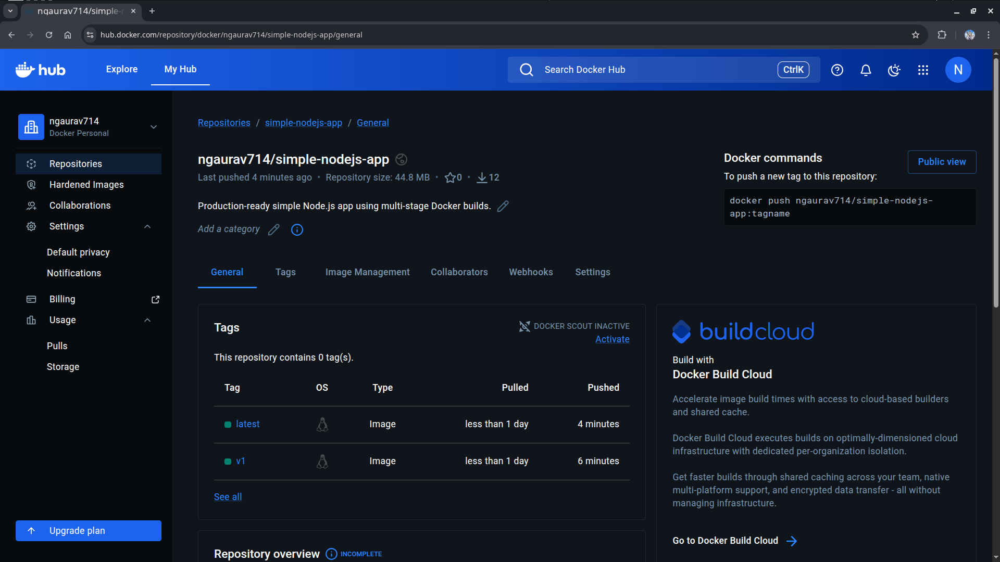
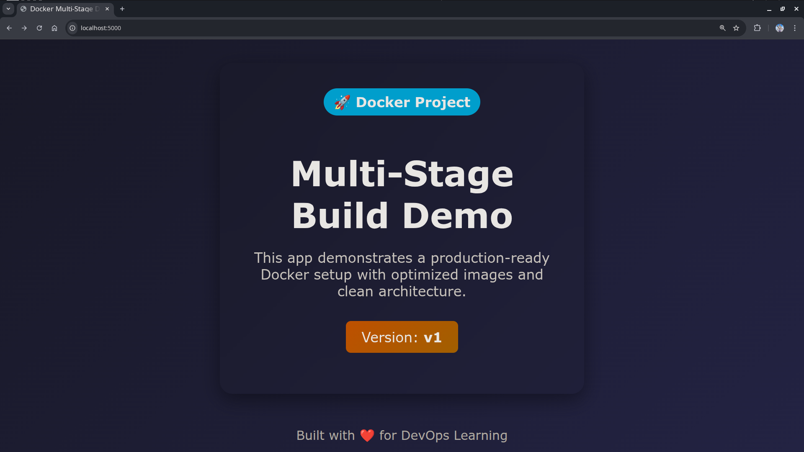
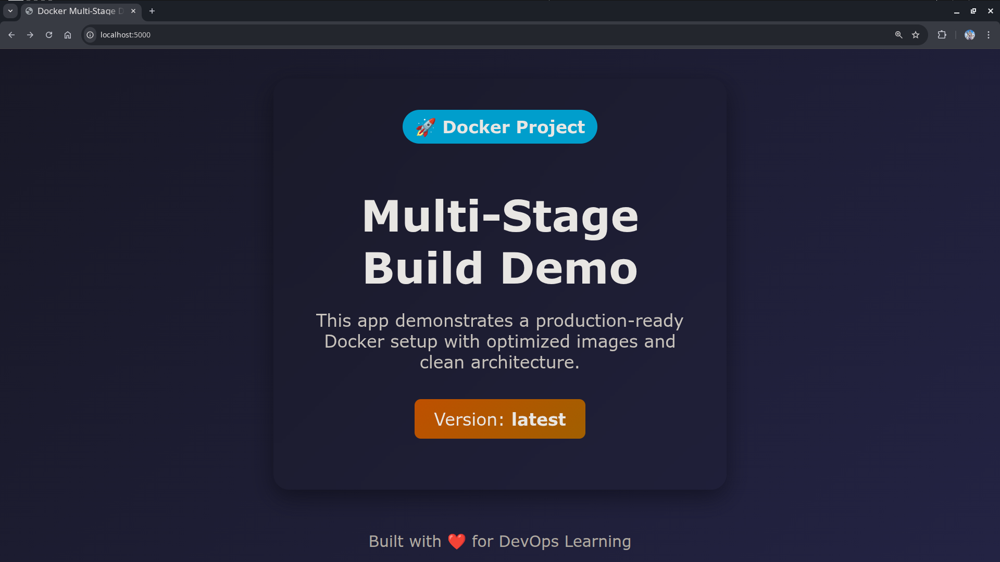

# Day 35 – Multi-Stage Builds & Docker Hub
Production-ready simple Node.js app using multi-stage Docker builds.

## Objective

Learn how to:

* Build **optimized Docker images using multi-stage builds**
* Reduce image size drastically
* Follow **production-grade Docker best practices**
* Push and manage images on **Docker Hub**

---

# Task 1: Problem with Large Images

## React + Node.js App (Basic Setup)

```
react-node-app/
 ├── backend/
 │    ├── server.js
 │    ├── package.json
 ├── frontend/
 │    ├── package.json
 │    ├── src/
 │    ├── build/   (generated after build)
 ├── Dockerfile.single
```

---

## Single-Stage Dockerfile (Bad Practice)

```dockerfile
FROM node:18

WORKDIR /app

COPY . .

# Install frontend deps and build
WORKDIR /app/frontend
RUN npm install
RUN npm run build

# Install backend deps
WORKDIR /app/backend
RUN npm install

EXPOSE 5000

CMD ["node", "server.js"]
```

---

## Build & Check Size

```bash
docker build -f Dockerfile.single -t nodejs-single .
docker images
```

Example Output:

```
react-node-single   1.0GB+
```


---

## Problems


* Includes **node_modules twice**
* Contains **build tools not needed at runtime**
* Large attack surface
* Slow deployments

---

# Task 2 – Multi-Stage Build (Production)

## Optimized Multi-Stage Dockerfile

```dockerfile
# ---------- Stage 1: Build Frontend ----------
FROM node:18 AS builder

WORKDIR /app/frontend
COPY frontend/package*.json ./
RUN npm install

COPY frontend/ .
RUN npm run build


# ---------- Stage 2: Production ----------
FROM node:18-alpine

WORKDIR /app

# Create non-root user
RUN addgroup app && adduser -S -G app app

# Copy backend
COPY backend/package*.json ./backend/
RUN cd backend && npm install --only=production

# Copy built frontend from builder
COPY --from=builder /app/frontend/build ./frontend/build

# Copy backend source
COPY backend/ ./backend/

WORKDIR /app/backend

USER app

EXPOSE 5000

CMD ["node", "server.js"]
```

---

## Build & Compare

```bash
docker build -f Dockerfile.multistage -t nodejs-multistage:v1 .
docker images
```

Output:

```
Single-stage:     1.09GB
Multi-stage:      132MB
```


---

## Why is it smaller?

* Build dependencies are **discarded**
* Only final artifacts are copied
* Uses **lightweight alpine image**
* No unnecessary files (cache, dev tools)

---

# Task 3 – Push to Docker Hub

## Login

```bash
docker login
```

---

## Tag Image

```bash
docker tag nodejs-multistage:v1 ngaurav714/simple-nodejs-app:v1
```

---

## Push

```bash
docker push ngaurav714/simple-nodejs-app:v1
```

---

## Verify

```bash
docker pull ngaurav714/simple-nodejs-app:v1
```

---

## Test Fresh Pull

```bash
docker rmi ngaurav714/simple-nodejs-app:v1
docker pull ngaurav714/simple-nodejs-app:v1
```

---

# Task 4: Docker Hub Repository

Go to: [Docker Hub](https://hub.docker.com/repository/docker/ngaurav714/simple-nodejs-app/general)

---



---

## Tag Behavior

| Tag           | Meaning                     |
| ------------- | --------------------------- |
| `latest`      | Default if no tag specified |
| `v1`, `v2`    | Versioned releases          |
| `dev`, `prod` | Environment-based           |

---

## Pull Behavior

```bash
docker pull ngaurav714/simple-nodejs-app
```

pulls `latest`

```bash
docker pull ngaurav714/simple-nodejs-app:v1
```

pulls specific version

---




---

# Task 5 – Best Practices Applied

## Improved Dockerfile

```dockerfile
FROM node:18-alpine

WORKDIR /app

# Create non-root user
RUN addgroup app && adduser -S -G app app

# Install deps (layer optimization)
COPY backend/package*.json ./backend/
RUN cd backend && npm install --only=production

# Copy app
COPY backend/ ./backend/

WORKDIR /app/backend

USER app

EXPOSE 5000

CMD ["node", "server.js"]
```

---

## Best Practices Used

### 1. Minimal Base Image

* `node:18-alpine` instead of `node:18`
* Saves **hundreds of MB**

---

### 2. Non-root User

```dockerfile
USER app
```

✔ Prevents security risks

---

### 3. Layer Optimization

```dockerfile
COPY package*.json
RUN npm install
```

✔ Better caching

---

### 4. Avoid `latest`

```dockerfile
FROM node:18-alpine
```

✔ Predictable builds

---

# Final Comparison

| Version       | Size   | Notes                      |
| ------------- | ------ | -------------------------- |
| Single-stage  | ~1.0GB | Dev + build tools included |
| Multi-stage   | ~200MB | Optimized                  |
| Best-practice | ~150MB | Production ready           |
